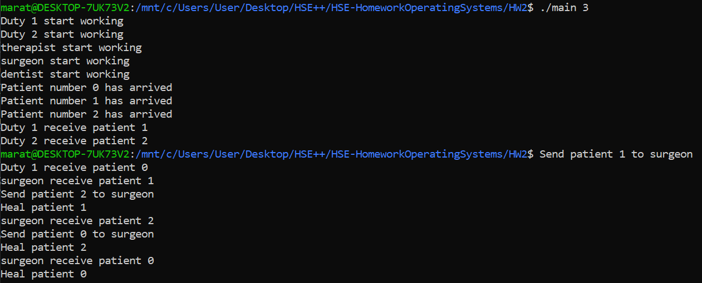

# Домашнее задание №2
🏫 Курс: "Операционные системы", тема: применение семафоров для организации взаимодействия параллельных процессов, вариант 11

# Задание на 4 балла
1. Багаев Марат Тимурович, БПИ216
2. Условие задачи(вариант 11):

   > Задача о больнице. В больнице два дежурных врача принимают
   пациентов, выслушивают их жалобы и отправляют или к стоматологу, или к хирургу, или к терапевту. Стоматолог, хирург и терапевт лечат пациентов. Каждый врач может принять только одного
   пациента за раз. Пациенты стоят в очереди к врачам и никогда их
   не покидают. Создать приложение, моделирующее рабочий
   день клиники. Каждого врача и каждого пациента реализовать
   в виде отдельного процесса.
3. Схема решения:

Будет 5 процессов-врачей. Два из них - это дежурные врачи. У них есть общий потокобезопасный буфер, в который пациенты пишут свой номер. Дежурный врач(рандомно) решает к кому из лечащих докторов отправить пациента и пишет его номер в соответсвующий потокебезопасный буфер. Лечащий врачи считывают номер пациента и имитируют его лечение.
   
4. Используемые средства: неименованные семафоры posix + разделяемая память posix
5. Инструкция по запуску:
   
   Для начала нужно скомпилировать программу с помощью команды ```gcc main.c -o main```. Далее нужно ее запустить указав в качестве аргументов количество пациентов
6. Демонстрация работы:



Да, есть небольшие проблемы с консольным выводом, но это нормально