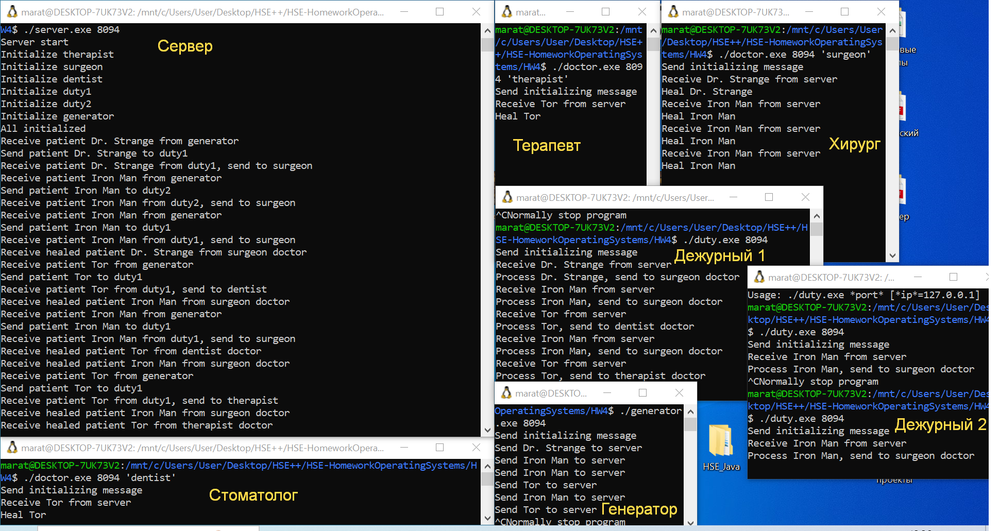

# Домашнее задание №4
🏫 Курс: "Операционные системы", тема: udp, вариант 11

# Задание на 4 балла
1. Багаев Марат Тимурович, БПИ216
2. Условие задачи:

   > Задача о больнице. В больнице два дежурных врача принимают пациентов, выслушивают их жалобы и отправляют или к стоматологу, или к хирургу, или к терапевту. Стоматолог, хирург и терапевт лечат пациентов. Каждый врач может принять только одного пациента за раз. Пациенты стоят в очереди к врачам и никогда их не покидают. Создать приложение, моделирующее рабочий день клиники. Каждого врача и очередь к нему реализовать как клиента. Поступающие пациенты формируются отдельным клиентом. Сервер перераспределяет пациентов по очередям и отслеживает общее взаимодействие клиентов.
3. Схема решения:

Всего будет 3 типа клиента:
- Клиент генератор пациентов
- Клиент дежурный врач
- Клиент лечащий врач

Взаимодействие между клиентами будет обеспечивать сервер, который также будет выводить информацию о работе приложения

В начале работы запускается сервер. Далее к нему подключаются все клиенты, отправляя сообщение со своей должностью:
- Дежурный - "duty"
- Стоматолог - "dentist"
- Хирург - "surgeon"
- Терапевт - "therapist"
- Генератора пациентов - "generator"

Генератор пациентов раз в случайное количество секунд отправляет на сервер сообщение вида "*имя пациента*". Никакого ответа от сервера этот клиент не ждет

Сервер принимает сообщение от генератора пациентов и отправляет полученное имя случайному дежурному врачу

Дежурный врач обрабатывает пациента и отправляет на сервер сообщение в формате "*имя_пациента*|*к_какому_врачу_его_отправить*" 

Сервер принимает сообщение от дежурного врача и отправляет имя пациента указанному лечащему врачу

Лечащий врач принимает имя, имитирует лечение и отправляет имя обратно серверу

Сервер работает в одном потоке и принимает сообщения по одному

4. Инструкции по запуску:
   
Для начала надо скомпилировать все программы, выполнив скрипт [start.sh](./start.sh) с помощью команды ```bash start.sh```

После выполнения появится папка out в которой будут лежать 4 исполняемых файла:
- server: его надо запускать командой ```./server *порт*```
- generator: ```./generator *порт* [*ip*=localhost]``` 
- duty: ```./duty *порт* [*ip*=localhost]``` 
- doctor: ```./doctor *порт* *специальность* [*ip*=localhost]```

Все программы можно завершать по Ctrl+C, тогда сокет будет закрыт(если использовать Ctrl+Z, то сокет не закроется)

5. Демонстрация работы


